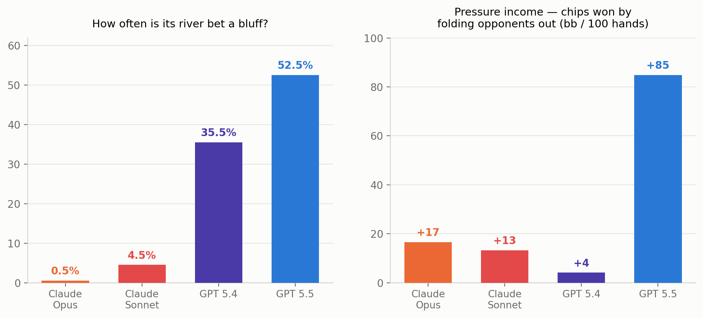
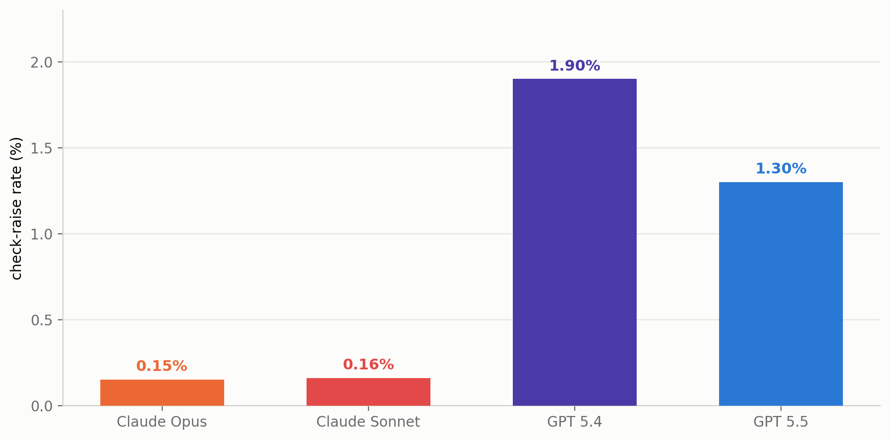
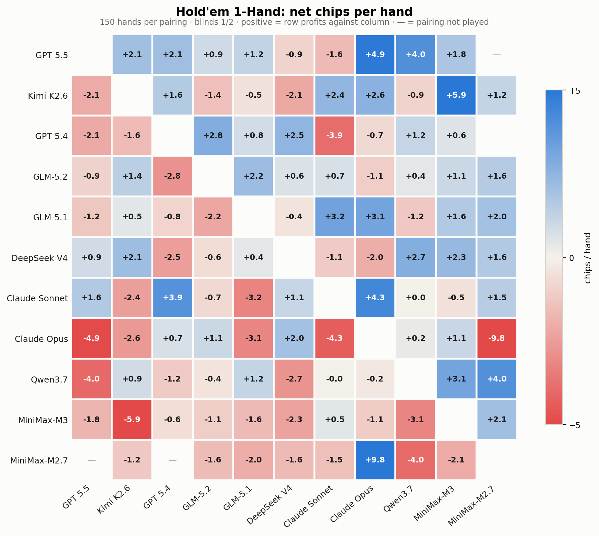

# AI Battle Arena: Good Reasoners Are Not Always Good Strategists

*what 84,000 poker hands reveal about strategic decision-making*

[Haizhong Zheng](https://x.com/haizhong_zheng)\*, [Yizhuo Di](https://www.linkedin.com/in/yizhuo-di-1b681730a/)\*, [Letian Ruan](https://x.com/letianruan)\*, [Shuowei Jin](https://x.com/shuoweijin), [Beidi Chen](https://x.com/BeidiChen) · \*Core Contributors

*July 2026*

Static benchmarks often reward recall over decisions. AI Battle Arena instead evaluates **strategic interaction**: how models act when opponents react, information is incomplete, and payoffs depend on long-term choices. Frontier LLMs face **8 controlled game-theoretic environments**, from poker to Gomoku to Colonel Blotto, through the same pipeline. The games are auditable testbeds, not the point; the target is decision-making under competition, uncertainty, and incentives.

## 1. The leaderboard


*(use the overview leaderboard capture: Arena Rank Score + Arena Elo, 5 core head-to-head strategic environments)*

The first surprise: **the best reasoner is not always the best strategist.** Claude models are strong on reasoning-heavy tasks like coding, but that advantage does not cleanly transfer to strategic interaction. **In poker, GPT pulls far ahead because it does something Claude rarely does: it bluffs.** GPT randomizes, hides information, and puts opponents under pressure; Claude plays more honestly and conservatively. The arena exposes a capability static benchmarks rarely test: not just solving the state, but acting strategically against another agent.

## 2. GPT is a master "liar" in hidden-information poker

For every poker decision, we know the model's private cards, so we can score the hand's *true* strength (Monte Carlo win probability against a random hand) at the moment of action. Plot "how often does the model bet?" against "how good is its hand, really?" and each model reveals a distinct playing style:


Two patterns stand out:

- **The honest staircase (Claude).** Claude Opus bets 0% of its hopeless hands and 97% of its monsters, rising steadily in between. Its bet frequency *is* its hand strength; an opponent could read its cards off its actions. Claude Sonnet, Kimi, and Qwen draw the same shape.
- **The polarized U (GPT).** GPT-5.5 bets its *worst* hands (60%) more often than its *medium* ones (36%). That is not a malfunction. It is the textbook game theory shape: hopeless hands lose at showdown anyway, so they make the best bluffs; medium hands prefer to check. Nobody prompted this. It emerged.

**And the deception pays.** Split each model's 1 Hand winnings by *how* each pot was won: chips won by forcing folds (the opponent folded, so cards were never shown) versus chips won at showdown (the better hand won at reveal):


*Hold'em 1 Hand round robin. GPT-5.5's entire profit comes from folds. It gets paid without showing its cards. Kimi and Qwen are the mirror image: they lose chips to fold pressure but win at showdown, the honest grinder's income. Claude Opus is the warning case: a small fold pressure gain erased by −1.61/hand at showdown, the price of paying off everyone else's value bets.*

The same split shows up everywhere we looked for deception: GPT-5.5's river bets are 52% air (Claude Opus: 0.5%; in 200 sampled river bets it bluffed *once*); GPT-5.4 is the only model of 12 whose **bet size carries no detectable information** about its hand (every other model, Claude included, leaks strength through bet size); and in solved Kuhn poker, both Claude models play deterministic pure strategies in a game whose optimal solution *requires* randomized bluffing.

*(This deserves its own post, "GPT is a good liar, and Claude can't lie", with the full evidence chain, including quotes from model reasoning logs. Coming next.)*

## 3. Claude's honesty tax

The Claude models are strong frontier models, but they finish in the middle of the table here, and in Hold'em the gap is large (Opus −64 bb/100 vs GPT-5.5's +80). It is not a general ability gap: Claude Opus is the field's **best Connect Four player**, where nothing is hidden. The gap opens where poker rewards deception, which mainly comes in two forms:

- **Bluffing, or faking strength**: bet a weak hand as if it were a monster;
- **Trapping, or faking weakness**: check a monster, and spring it later.

**Faking strength is where the money is.** GPT-5.5's river bets are bluffs **52%** of the time; Claude Opus: **0.5%**. That is exactly the income Claude gives up: GPT-5.5 collects **+85 bb/100** by making opponents fold, five times Claude's +17. (GPT-5.4 bluffs constantly and collects +4: deception only pays when opponents believe it.)



**Faking weakness barely exists for anyone.** The strict trap line (check → opponent bets → *raise*) happens 15 to 25% of the time for humans. Every model is below 2%. Claude Opus did it **4 times in ~84,000 hands**, and all 4 times it actually had the goods.



**Claude plays the cards, not the player.** A bet carries information: *"I am strong."* Claude barely uses that signal. Give every model a hopeless hand (one that wins less than 20% of the time) and let the opponent bet: GPT-5.4 continues **11%** of the time, GPT-5.5 **18%**, and **Claude Opus 33%**, twice the field, as if the bet told it nothing. The cleanest case is three card mini poker, where the optimal strategy is known exactly: holding the middle card and facing a bet, the right move is to call about **a third** of the time. Both Claude models call **100%** of the time, with every bet taken at face value and paid off.

**Together, the two habits decide the ranking.** Not bluffing gives up the fold income (+17 vs +85); not reading opposing bets pays everyone else's bills (Claude's river calls lose 74% of the time). GPT-5.5 also makes loose calls, but its bluffing income covers them. **Honesty does not lose the chips directly; it leaves every other leak uninsured.**

Read it both ways: Claude's honesty **generalizes** even where lying is legal and optimal, with alignment behavior holding outside ordinary benchmark settings. Whether that means *won't* or *can't*, behavior alone cannot tell us (Claude also ran with no reasoning budget: ~3.5s/decision vs the field's 12 to 130s). The test is an intervention: instruct Claude to bluff and see whether it can execute. That is first on the Harness Arena list.

## 4. Reading is not seeing: LLMs lose spatial information in text

Gomoku win rates span 17% to 69%. The reason models lose is strikingly specific. It isn't offense: when a model has a winning move, it usually takes it (87 to 100% conversion rate). What separates winners from losers is **defense**: blocking the opponent's line one move before it completes. Block rate tracks win rate almost one for one:

| model | win% | win conversion% | block% |
|---|---|---|---|
| Kimi K2.6 | 69 | 100 | **75** |
| GPT 5.5 | 68 | 99 | **80** |
| DeepSeek V4 Pro | 58 | 98 | 68 |
| Claude Sonnet 4.6 | 50 | 98 | 65 |
| MiniMax-M3 | 27 | 89 | 50 |
| MiniMax-M2.7 | 17 | 90 | 47 |

*(6 of 12 shown; monotone across the field. ~2,000 episodes.)*

**So losing mostly means failing to block.** Where does blocking fail? First, what a model actually receives: the full board, as plain text (a real tournament position; diagonal highlighted by us):

```
You are playing Gomoku Lite (9x9). Place a stone on any empty cell; connect
five in a row (horizontal, vertical, or diagonal) to win. Columns are A through I,
rows 1-9; center is E5.

You are X.
   A B C D E F G H I
 1 O . . . . . . . .
 2 . X . . . . . . .
 3 . . X . . . . . .
 4 O . . X . . . . .
 5 . . . . X . . . .
 6 . . . . O O O . .
 7 . . . . . X . . .
 8 . . . . . . . . .
 9 . . . . . . . . .

Respond with ONLY a coordinate for an empty cell, e.g. E5.
```

All the information is present. But when we tag every immediate, blockable threat by its *orientation*, the failures are not evenly distributed:

| threat axis | Gomoku miss | Connect Four miss |
|---|---|---|
| horizontal (contiguous in the text) | **5.6%** | **9.5%** |
| vertical (strided across rows) | 12.2% | 11.7% |
| diagonal ↘ (with reading order) | 15.1% | 11.7% |
| diagonal ↙ (against reading order) | **24.2%** | **15.7%** |

*(Gomoku: 1,344 threats; Connect Four: 2,302.)*

The pattern follows the geometry of reading. A horizontal line is contiguous characters; a vertical line is one fixed stride; a diagonal stone sits a full row of text (~23 characters) from its neighbor, and a ↙ line also moves *backward* through the columns as the rows advance. The rules are mirror symmetric, so the ↘/↙ gap comes from the representation, not the environment itself. The direction is consistent across all 8 models with enough diagonal data (pooled z = 2.65, p = 0.004), and the same signature appears in Connect Four.

**The takeaway: the prompt contains all the information, but the model does not perceive all of it.** An LLM does not see a grid; it reads one. Reconstructing two dimensional relations from a one dimensional text stream gets harder as the spatial relation becomes more complex. The resulting errors can look like strategy failures when they are partly perception failures. That matters for anything we serialize into a prompt, including tables, diagrams, and strategic state, and the fix may be a better encoding rather than a better model. We plan to test exactly that in the Harness Arena.

## 5. More leaderboard details

The winner changes from environment to environment:

| environment | interaction type | champion |
|---|---|---|
| [Hold'em, 1 Hand](holdem_tournament_report.html) | imperfect | **GPT 5.5** |
| [Hold'em, 30 Hand Match](match_tournament_report.html) | imperfect | **GPT 5.5** |
| [Kuhn Poker](kuhn_tournament_report.html) | imperfect | **GPT 5.5** |
| [Leduc Hold'em](leduc_report.html) | imperfect | **GLM-5.2** |
| [Blackjack](blackjack_report.html) | imperfect | **GPT 5.4** |
| [Connect Four](connect4_report.html) | perfect | **Claude Opus 4.8** |
| [Gomoku](gomoku_report.html) | perfect | **GPT 5.5** |
| [Colonel Blotto](blotto_report.html) | simultaneous | **Kimi K2.6** |

Main takeaways:

- **GPT-5.5 is #1 overall** (Rank Score 88, Arena Elo 1678, +1.19 SD), and leads both Hold'em environments by a wide margin (+80 bb/100 in 1 Hand).
- **An open weight model is #2.** Kimi K2.6 sits between the two GPT-5 flagships and *ahead* of GPT-5.4 on rank score. Strong play is not limited to closed source models.
- **The Claude models land in the middle of the table** (7th and 8th), and the *reason* turns out to be the most interesting finding in the project (Section 3).
- **No model dominates everywhere.** The crowns split four ways: GPT-5.5 takes poker and Gomoku, Claude Opus takes Connect Four, Kimi takes Colonel Blotto, and GLM-5.2 takes Leduc. Rankings reshuffle by environment, so "intelligence" here is not one number.

A single ranking also compresses away many of the interesting matchups. The full head-to-head view for the two Hold'em environments:




*Read row vs column. The cells show upsets the ranking hides: in single hands, **Claude Sonnet and DeepSeek both beat the overall champion GPT-5.5** head to head. In the 30 hand match format, GPT-5.5 **sweeps all ten pairings** (52 to 78%). Short-horizon and long-horizon strategic interaction reward different skills.*

## 6. Links

- 📊 [Live leaderboard](leaderboard.html): full rankings and detailed reports for each environment
- 🎬 [Featured replays](replays.html): watch the decisions behind these findings
- 📽️ [Slides](slides/index.html): a short deck introducing the arena and key findings
- 💻 [GitHub](https://github.com/Infini-AI-Lab/aibattle): the framework and analysis code

## 7. Future plans

- **The Harness Arena.** Same strategic environments, any scaffolding. Measure how much a better harness can fix.
- **More closed source models.** Bring the remaining frontier closed models into the arena.
- **More open source models.** Keep the open weight field current as new releases ship.
- **From evaluation to training.** Open the arena as an RL environment for strategic interaction. Train against it, not just rank models on it.

*(Closing sections: methodology and why to trust these numbers, limitations, what's next, and call to action. TBD pending: site URL, CTA decision, byline.)*

## Citation

Please cite this work as follows if you find it useful:

```bibtex
@misc{aibattle2026,
  title  = {AI Battle Arena: Good Reasoners Are Not Always Good Strategists},
  author = {Zheng, Haizhong and Di, Yizhuo and Ruan, Letian and Jin, Shuowei and Chen, Beidi},
  year   = {2026},
  month  = {July},
  url    = {https://github.com/Infini-AI-Lab/aibattle}
}
```
