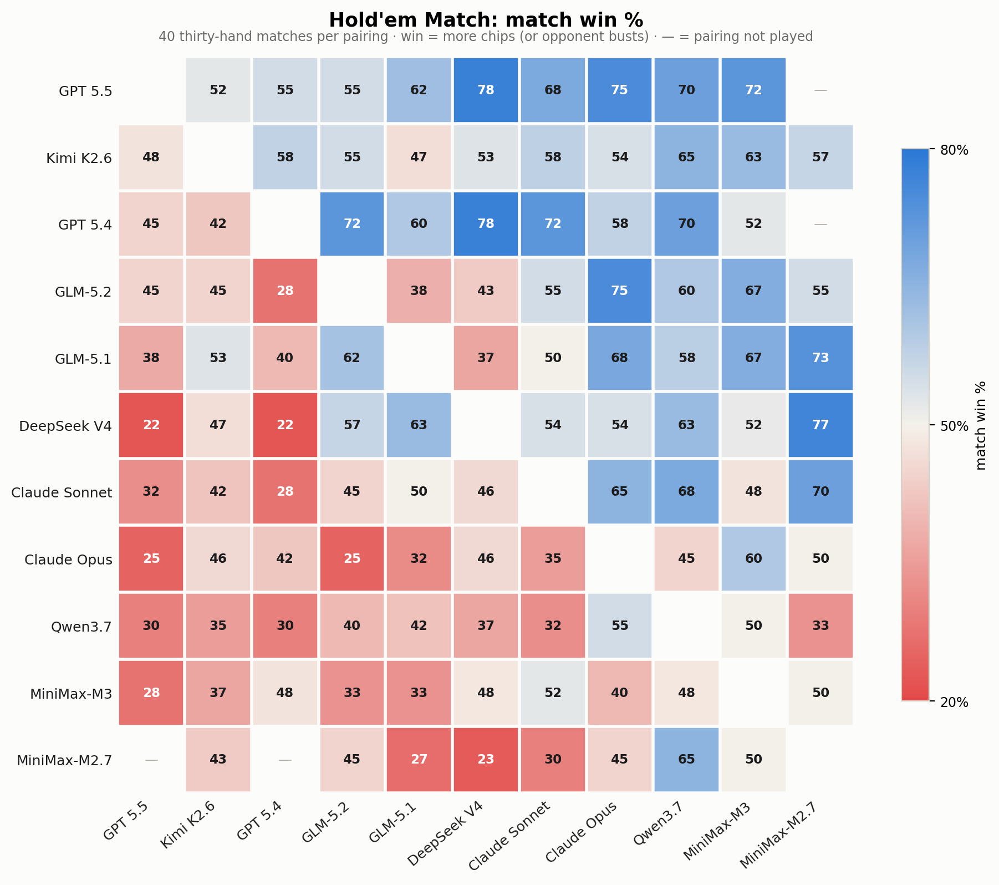
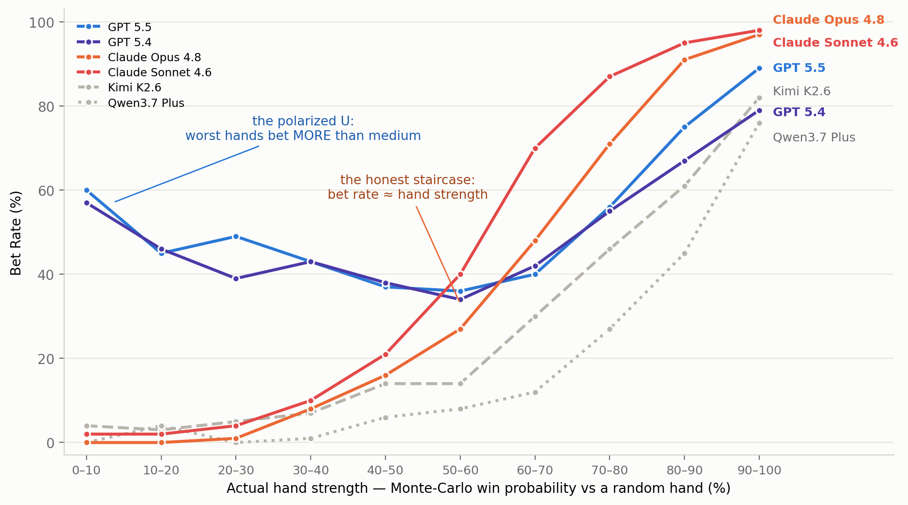
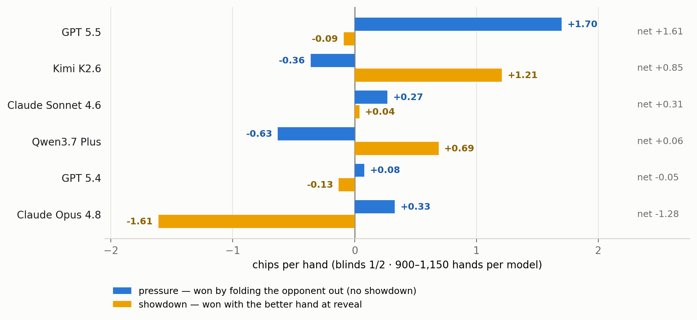

# AI Battle Arena: Benchmarking LLMs with Adversarial Games

*what 84,000 hands of poker reveal that static benchmarks can't*

[Haizhong Zheng](https://x.com/haizhong_zheng)\*, [Yizhuo Di](https://www.linkedin.com/in/yizhuo-di-1b681730a/)\*, [Letian Ruan](https://x.com/letianruan)\*, [Shuowei Jin](https://x.com/shuoweijin), [Beidi Chen](https://x.com/BeidiChen) · \*Core Contributors

*July 2026*

> **TL;DR:** We built an arena where frontier LLMs play 8 adversarial games — poker, Gomoku, Colonel Blotto and more — head-to-head under one identical pipeline, and ranked them with Elo. GPT-5.5 tops the leaderboard. But the ranking is the least interesting thing we found. Because every decision is logged with ground truth, the games work like a behavioral microscope: they show *how* each model wins, loses — and lies. Some models turn out to be textbook bluffers; one family is so honest you can read its cards from its bets.

---

## 1. The leaderboard


*(use the overview leaderboard capture: Arena Rank Score + Arena Elo, 5 core head-to-head games)*

And game by game, the crown moves around:

| game | info | champion |
|---|---|---|
| [Hold'em, 1-Hand](holdem_tournament_report.html) | imperfect | **GPT 5.5** |
| [Hold'em, 30-hand Match](match_tournament_report.html) | imperfect | **GPT 5.5** |
| [Kuhn Poker](kuhn_tournament_report.html) | imperfect | **GPT 5.5** |
| [Leduc Hold'em](leduc_report.html) | imperfect | **GLM-5.2** |
| [Blackjack](blackjack_report.html) | imperfect | **GPT 5.4** |
| [Connect Four](connect4_report.html) | perfect | **Claude Opus 4.8** |
| [Gomoku](gomoku_report.html) | perfect | **GPT 5.5** |
| [Colonel Blotto](blotto_report.html) | simultaneous | **Kimi K2.6** |

Headlines:

- **GPT-5.5 is #1 overall** (Rank Score 88, Arena Elo 1678, +1.19 SD) — and it is #1 in both poker formats by a wide margin (+80 bb/100 in 1-Hand).
- **An open-weight model is #2.** Kimi K2.6 sits between the two GPT-5 flagships and *ahead* of GPT-5.4 on rank score. The frontier is not closed-source-only.
- **The Claude models land mid-table** (7th and 8th) — and the *reason* turns out to be the most interesting finding in the whole project (Section 2).
- **No model dominates everywhere.** The crowns split four ways: GPT-5.5 takes poker and Gomoku, Claude Opus takes Connect Four, Kimi takes Colonel Blotto, GLM-5.2 takes Leduc. Rankings reshuffle game by game — "intelligence" here is not one number.

A single-column ranking is also a lossy compression of what actually happened. The full head-to-head picture for the two poker formats:



*Read row vs column. The cells hold upsets the ranking hides: in single hands, **Claude Sonnet and DeepSeek both beat the overall champion GPT-5.5** head-to-head — yet in the 30-hand match format GPT-5.5 **sweeps all ten pairings** (52–78%). Winning a hand and winning a match are different skills.*

A ranking answers *who* wins. Because we hold every hole card and every line of reasoning, we can also answer *why* — and the answers don't look like anything a static benchmark produces. The next three sections are three of those answers.

## 2. GPT is a master "liar" in poker games

For every poker decision, we know the model's private cards, so we can score the hand's *true* strength (Monte-Carlo win probability against a random hand) at the moment of action. Plot "how often does the model bet?" against "how good is its hand, really?" — and each model draws its personality:



Two species:

- **The honest staircase (Claude).** Claude Opus bets 0% of its hopeless hands and 97% of its monsters, rising monotonically in between. Its bet frequency *is* its hand strength — an opponent could read its cards off its actions. Claude Sonnet, Kimi, and Qwen draw the same shape.
- **The polarized U (GPT).** GPT-5.5 bets its *worst* hands (60%) more often than its *medium* ones (36%). That's not a malfunction — it is the textbook game-theory structure: hopeless hands lose at showdown anyway, so they make the best bluffs; medium hands prefer to check. Nobody prompted this. It emerged.

**And the lying pays.** Decompose each model's 1-Hand winnings by *how* each pot was won: **pressure** chips (the opponent folded — cards never shown) versus **showdown** chips (won with the better hand at reveal):


*Hold'em 1-Hand round-robin. GPT-5.5's entire profit is pressure — it gets paid without showing its cards. Kimi and Qwen are its mirror image: they lose the pressure war but win at showdown. Claude Opus is the cautionary tale — a small pressure gain wiped out by −1.61/hand at showdown, the price of paying off everyone else's value bets.*

The same split shows up everywhere we looked for deception: GPT-5.5's river bets are 52% air (Claude Opus: 0.5% — in 200 sampled river bets it bluffed *once*); GPT-5.4 is the only model of 12 whose **bet sizing carries no information** about its hand (every other model, Claude included, statistically leaks strength through bet size); and in solved Kuhn poker, both Claude models play deterministic pure strategies — in a game whose optimal solution *requires* randomized bluffing.

One asymmetry holds for every model, though: **they bluff, but they never trap.** Not one of 12 models slow-plays strong hands at even half the rate it checks medium ones, and both Claudes check-raise ~100× less often than human baseline. LLMs learned the *aggressive* half of deception — the half that's written down in poker books — and not the *distributional* half that only exists across many hands.

*(This deserves its own post — "GPT is a good liar, and Claude can't lie" — with the full evidence chain: intent quotes from model reasoning logs included. Coming next.)*

## 3. Claude's honesty tax

The Claude models are frontier models that finish mid-table — in Hold'em the gap is brutal (Opus −64 bb/100 vs GPT-5.5's +80). It isn't ability: Claude Opus is the field's **best Connect Four player**, where nothing is hidden. The gap opens exactly where poker rewards deception — which comes in exactly two moves:

- **Bluffing — faking strength**: bet a weak hand as if it were a monster;
- **Trapping — faking weakness**: check a monster, and spring it later.

**Faking strength is where the money is.** GPT-5.5's river bets are bluffs **52%** of the time; Claude Opus: **0.5%**. That is the income Claude forgoes — GPT-5.5 collects **+85 bb/100** by folding opponents out, five times Claude's +17. (GPT-5.4 bluffs constantly and collects +4: lying only pays when people believe you.)


**Faking weakness barely exists — for anyone.** The strict trap line (check → opponent bets → *raise*) is a 15–25% play for humans. Every model lives below 2%. Claude Opus: **4 times in ~84,000 hands** — all 4 times it actually had the goods.


**Claude plays the cards, not the player.** A bet carries information — *"I am strong."* Claude barely uses it. Put a hopeless hand (wins <20% of the time) in every model's hands and let the opponent bet at them: GPT-5.4 pays to continue **11%** of the time, GPT-5.5 **18%** — **Claude Opus pays 33%**, twice the field, as if the bet told it nothing. The cleanest case is a three-card mini-poker whose optimal strategy is exactly known: holding the middle card, facing a bet, the right move is to pay about **a third** of the time. Both Claude models pay **100%** — every single bet, taken at face value, checked with money.

**Together, the two habits decide the ranking.** Not bluffing forfeits the income (+17 vs +85); not listening pays everyone else's bills (river calls lose 74% of the time). GPT-5.5 makes similar loose calls — but its lying income covers them. **Honesty doesn't lose the chips directly — it leaves every other leak uninsured.**

Read it both ways: Claude's honesty **generalizes** even where lying is legal and optimal. Whether that's *won't* or *can't*, behavior alone can't say (Claude also ran with no reasoning budget: ~3.5s/decision vs 12–130s). The test: instruct Claude to bluff and see if it executes — first on the Harness Arena list.

## 4. Reading is not seeing: LLMs lose spatial information in text

Gomoku win rates span 17% to 69% — and the reason models lose is strikingly specific. It isn't offense: every model completes its own winning line when one is available (87–100%). What separates winners from losers is **defense** — blocking the opponent's line one move before it completes. Block rate tracks win rate almost 1:1:

| model | win% | win-take% | block% |
|---|---|---|---|
| Kimi K2.6 | 69 | 100 | **75** |
| GPT 5.5 | 68 | 99 | **80** |
| DeepSeek V4 Pro | 58 | 98 | 68 |
| Claude Sonnet 4.6 | 50 | 98 | 65 |
| MiniMax-M3 | 27 | 89 | 50 |
| MiniMax-M2.7 | 17 | 90 | 47 |

*(6 of 12 shown; monotone across the field. ~2,000 games.)*

**So losing = failing to block.** Where does blocking fail? First, what a model actually receives — the full board, as plain text (real position; diagonal marked):

```
You are playing Gomoku-Lite (9x9). Place a stone on any empty cell; connect
five in a row (horizontal, vertical, or diagonal) to win. Columns are A-I,
rows 1-9; center is E5.

You are X.
   A B C D E F G H I
 1 O . . . . . . . .
 2 . X . . . . . . .
 3 . . X . . . . . .
 4 O . . X . . . . .
 5 . . . . X . . . .
 6 . . . . O O O . .
 7 . . . . . X . . .
 8 . . . . . . . . .
 9 . . . . . . . . .

Respond with ONLY a coordinate for an empty cell, e.g. E5.
```

All the information is right there. But tag every immediate, blockable threat by its *orientation*, and block failures are anything but uniform:

| threat axis | Gomoku miss | Connect Four miss |
|---|---|---|
| horizontal (contiguous in the text) | **5.6%** | **9.5%** |
| vertical (strided across rows) | 12.2% | 11.7% |
| diagonal ↘ (with reading order) | 15.1% | 11.7% |
| diagonal ↙ (against reading order) | **24.2%** | **15.7%** |

*(Gomoku: 1,344 threats; Connect Four: 2,302.)*

The gradient follows the geometry of reading: a horizontal line is contiguous characters; a vertical line one fixed stride; a diagonal stone sits a full row of text (~23 characters) from its neighbor — and a ↙ line additionally walks *backwards* through the columns. The rules are mirror-symmetric, so the ↘/↙ gap can only come from the representation; the direction is unanimous across all 8 models with enough data (z=2.65, p=0.004), and it replicates in Connect Four.

**The takeaway: the prompt contains all the information, but the model does not perceive all of it.** An LLM doesn't see a grid — it reads one. Rebuilding 2-D relations from a 1-D stream degrades as the spatial relation gets more complex, and the resulting errors look like skill gaps while actually being perception gaps. That applies to anything serialized into a prompt — tables, diagrams, game state — and the fix may be a better encoding rather than a better model. We plan to test exactly that in the Harness Arena.

## 5. Links

- 📊 [Live leaderboard](index.html) — full rankings and every game's deep-dive report
- 🎬 [Featured replays](replays.html) — watch the hands and games behind these findings
- 📽️ [Slides](../slides/index.html) — a short deck introducing the arena and its findings
- 💻 [GitHub](https://github.com/Infini-AI-Lab/aibattle) — the framework and analysis code

## 6. Future plans

- **The Harness Arena.** Same games, any scaffolding — measure how much of the above a better harness can fix.
- **More closed-source models.** Bring the remaining frontier closed models into the arena.
- **More open-source models.** Keep the open-weight field current as new releases ship.
- **From evaluation to training.** Open the arena as an RL environment — train against it, not just rank on it.

*(Closing sections — methodology & why to trust these numbers, limitations, what's next + call to action — TBD pending: site URL, CTA decision, byline.)*

## Citation

Please cite this work as follows if you find it useful:

```bibtex
@misc{aibattle2026,
  title  = {AI Battle Arena: Benchmarking LLMs with Adversarial Games},
  author = {Zheng, Haizhong and Di, Yizhuo and Ruan, Letian and Jin, Shuowei and Chen, Beidi},
  year   = {2026},
  month  = {July},
  url    = {https://github.com/Infini-AI-Lab/aibattle}
}
```
